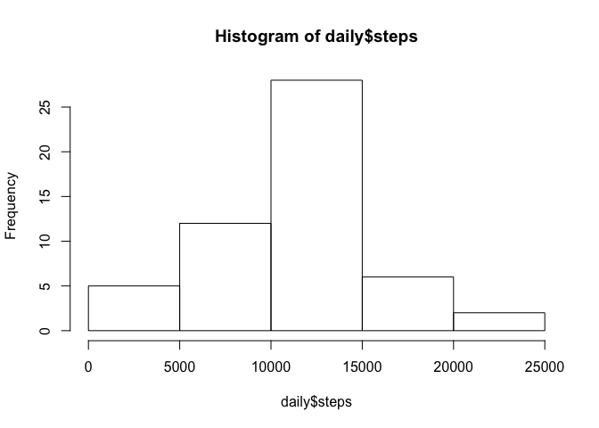
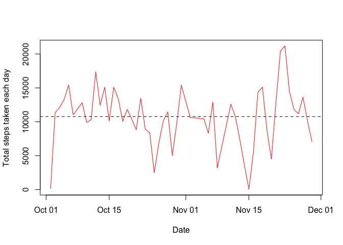
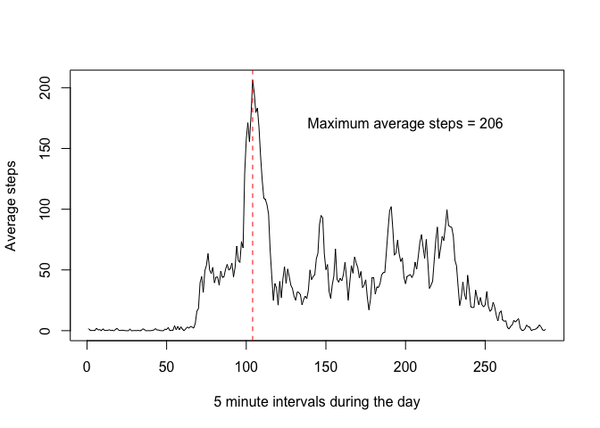
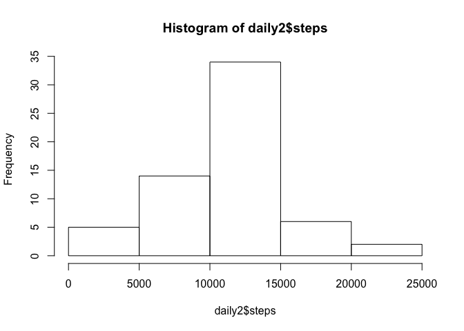
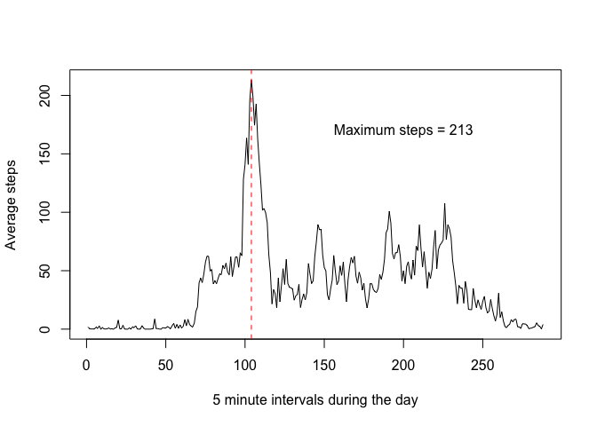
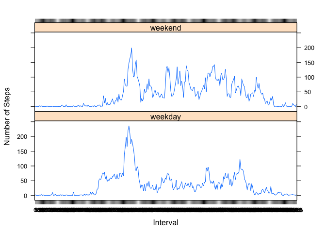

# Reproducible Research: Peer Assessment 1
ryaxley  
February 28, 2016  


## Loading and preprocessing the data

```r
setwd("~/Reproducible.Research/code/Project.1/RepData_PeerAssessment1/")
df <- read.csv(unz("activity.zip", "activity.csv"), header=T, sep=",")

# Convert date variable to date format
df$date <- as.Date(df$date, format="%Y-%m-%d")

# Convert interval variable to factor
df$interval <- as.factor(df$interval)
```


## What is mean total number of steps taken per day?

```r
# Aggregate steps by day
daily <- aggregate(steps ~ date, df, sum)

# Total steps by day (sorted)
sort(daily$steps, decreasing = TRUE)
```

```
##  [1] 21194 20427 17382 15420 15414 15110 15098 15084 14478 14339 13646
## [12] 13460 13452 13294 12883 12811 12787 12608 12426 12116 11834 11829
## [23] 11458 11352 11162 11015 10765 10600 10571 10439 10395 10304 10183
## [34] 10139 10119 10056  9900  9819  8918  8841  8821  8355  8334  7336
## [45]  7047  6778  5441  5018  4472  3219  2492   126    41
```

```r
# Histogram of daily steps
hist(daily$steps, breaks = 5)
```



```r
# Mean steps per day
mean(daily$steps)
```

```
## [1] 10766.19
```

```r
# Median steps per day
median(daily$steps)
```

```
## [1] 10765
```


## What is the average daily activity pattern?

```r
# Exploratory plot of avg steps across days
plot(daily$date, daily$steps, type="l", col='red', 
     xlab="Date", ylab="Total steps taken each day")
abline(h=mean(daily$steps), lwd=1, lty=2 )
```



```r
# Mean steps by 5 minute intervals
interval <- aggregate(steps ~ interval, df, mean)
plot(interval$steps, type="l", 
     xlab="5 minute intervals during the day", ylab="Average steps")

# Maximum number of steps per 5-m interval across days
max(interval$steps)
```

```
## [1] 206.1698
```

```r
abline(v=which.max(interval$steps), col="red", lty=2)
text(200,170, paste("Maximum average steps =", round(max(interval$steps))))
```



## Imputing missing values
With the MICE package we imputed missing values. The overall pattern remains very similar to the original data. 

```r
# Number of missing values
length(subset(df, is.na(steps))$steps)
```

```
## [1] 2304
```

```r
# Impute library: Multivariate Imputation by Chained Equations  
library(mice)
```

```
## Loading required package: Rcpp
```

```
## Warning: package 'Rcpp' was built under R version 3.2.3
```

```
## mice 2.25 2015-11-09
```

```r
df2 <- df
# Date variable needs to be converted for MICE to run
df2$date <- as.character(df2$date)
# Impute data
temp <- mice(df2, m=5, maxit=10, meth='pmm', seed=500)
```

```
## 
##  iter imp variable
##   1   1  steps
##   1   2  steps
##   1   3  steps
##   1   4  steps
##   1   5  steps
##   2   1  steps
##   2   2  steps
##   2   3  steps
##   2   4  steps
##   2   5  steps
##   3   1  steps
##   3   2  steps
##   3   3  steps
##   3   4  steps
##   3   5  steps
##   4   1  steps
##   4   2  steps
##   4   3  steps
##   4   4  steps
##   4   5  steps
##   5   1  steps
##   5   2  steps
##   5   3  steps
##   5   4  steps
##   5   5  steps
##   6   1  steps
##   6   2  steps
##   6   3  steps
##   6   4  steps
##   6   5  steps
##   7   1  steps
##   7   2  steps
##   7   3  steps
##   7   4  steps
##   7   5  steps
##   8   1  steps
##   8   2  steps
##   8   3  steps
##   8   4  steps
##   8   5  steps
##   9   1  steps
##   9   2  steps
##   9   3  steps
##   9   4  steps
##   9   5  steps
##   10   1  steps
##   10   2  steps
##   10   3  steps
##   10   4  steps
##   10   5  steps
```

```r
df2 <- complete(temp, include=TRUE)

# Aggregate steps by day
daily2 <- aggregate(steps ~ date, df2, sum)

# Histogram of daily steps
hist(daily2$steps, breaks = 5)
```



```r
# Mean steps per day
mean(daily2$steps)
```

```
## [1] 10754.59
```

```r
# Median steps per day
median(daily2$steps)
```

```
## [1] 10600
```

```r
# Mean steps by 5 minute intervals
interval2 <- aggregate(steps ~ interval, df2, mean)
plot(interval2$steps, type="l", 
     xlab="5 minute intervals during the day", ylab="Average steps")

# Maximum number of steps per 5-m interval across days
max(interval2$steps)
```

```
## [1] 213.3279
```

```r
abline(v=which.max(interval2$steps), col="red", lty=2)
text(200,170, paste("Maximum steps =", round(max(interval2$steps))))
```




## Are there differences in activity patterns between weekdays and weekends?
Segregating the data by day of the week we can see a larger number of steps distributed throughout the entire day compared to the weekdays.

```r
# Create a new factor variable for day of the week
df2$day <- NA
df2$date <- as.Date(df2$date)
df2$day <- weekdays(df2$date)
df2[df2$day == 'Monday', ]$day <- 'weekday'
df2[df2$day == 'Tuesday', ]$day <- 'weekday'
df2[df2$day == 'Wednesday', ]$day <- 'weekday'
df2[df2$day == 'Thursday', ]$day <- 'weekday'
df2[df2$day == 'Friday', ]$day <- 'weekday'
df2[df2$day == 'Saturday', ]$day <- 'weekend'
df2[df2$day == 'Sunday', ]$day <- 'weekend'

df2 <- aggregate(steps ~ day+interval, df2, mean)

library(lattice)

xyplot(steps~interval|factor(day), data=df2,
       type='l', layout=c(1,2),
       xlab='Interval', ylab='Number of Steps')
```


